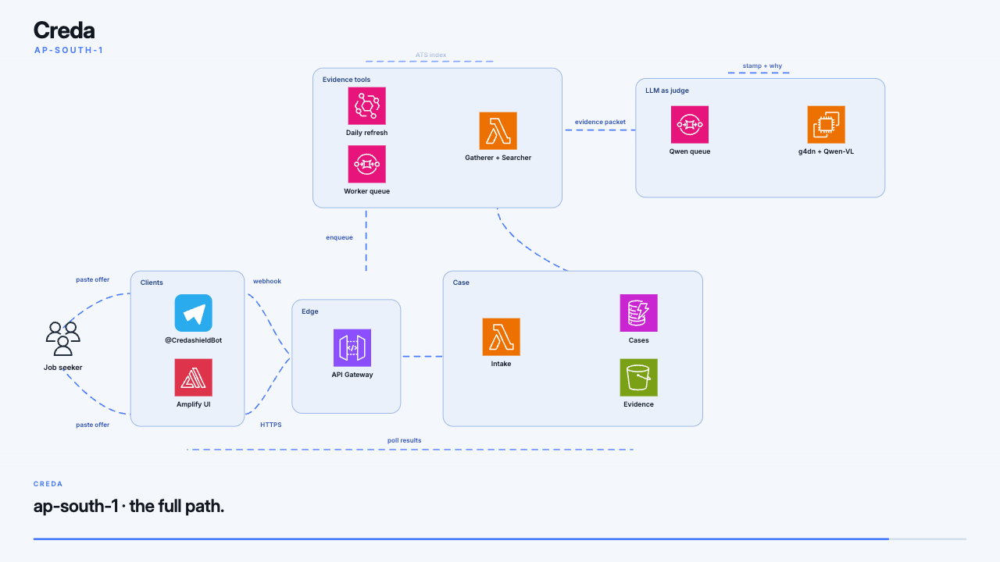

# Creda - check the offer before you send the money

Students keep getting WhatsApp "HR" with a Flipkart logo, a Rs 2,499 PhonePe kit, and a Gmail address. Creda is the 30-second check we wanted before anyone pays.

[Open the live app](https://main.d32sg54oqu2gcb.amplifyapp.com/) · [Telegram @CredashieldBot](https://t.me/CredashieldBot) · Mumbai `ap-south-1`



[60-second architecture tour](docs/creda-architecture.mp4)

Paste the offer. We stamp **high risk**, **unverified**, or **no conflict found**. No account. Same loop on the web, Telegram, and a Chrome extension.

## Why this one

1. **Same text the scammer sent.** We do not need a cleaned demo. Drop the WhatsApp copy in and wait for the stamp.
2. **Official sources, not vibes.** Gatherer + Searcher hits employer ATS indexes, domain checks, and known fee tactics. EventBridge refreshes that index daily.
3. **Three honest rulings.** High risk when they ask for UPI. Unverified when LinkedIn is vague. No conflict when the Greenhouse link is real. We are not a fear machine.
4. **Cheap enough to leave on.** API Gateway HTTP + Lambda + DynamoDB + SQS + S3 + Amplify sit in free tier or a few USD a month at student volume. The only real bill is a warm judge.
5. **Built for the person with chat open.** No Cognito. A case token in the header. Mumbai region, next to the phones getting these texts.

## Cost (Mumbai)

| What | What you pay |
| --- | --- |
| 1,000 checks / month, judge off | under USD 5 |
| Warm Fargate judge (4 vCPU / 8 GB) | ~USD 5 / day, scale to 0 after judging |
| GPU for screenshots (g4dn.xlarge) | ~USD 0.58 / hour, `scripts/creda_gpu_up.sh` then down |

One fake "laptop deposit" already costs more than a weekend of Creda with the text judge warm.

## Paste these

**Scam (full loop):**

```
Flipkart hiring for WFH catalog tagging. Salary 35k/month. Buy starter kit Rs 2499 on PhonePe to hr.flipkart.wfh@gmail.com. Training on WhatsApp group only.
```

**Not enough proof:**

```
LinkedIn InMail from Notion Talent: We loved your profile for a remote PM role. Reply with your salary expectation. Interview tomorrow on Google Meet, no prep needed.
```

**Looks fine:** a real Greenhouse or careers URL. No fee.

## How it runs

```
seeker -> Amplify UI / Telegram
      -> API Gateway HTTP API
      -> Intake Lambda -> DynamoDB + S3
      -> SQS -> Gatherer / Searcher Lambda  (EventBridge daily ATS refresh)
      -> SQS -> Fargate Qwen3-4B  (optional g4dn + Qwen-VL)
      -> poll DynamoDB -> stamp
```

HTTP API instead of REST (cheaper for this traffic). Evidence bundle is built offline and stored on S3 so Lambda does not run pandas on click. GPU is opt-in and the ASG goes to zero when we are not filming.

## Run it

```bash
python -m venv .venv && source .venv/bin/activate
pip install -r requirements.txt
bash scripts/serve_frontend.sh
```

```bash
curl -s https://x1ed4uf5q9.execute-api.ap-south-1.amazonaws.com/health | jq .
```

Deploy: `DEPLOY.md`. Telegram: `docs/TELEGRAM_SETUP.md`.

```
backend/     Lambda
frontend/    Amplify app
infra/       SAM + ECS
deploy/bundle/  evidence JSON
extension/   Chrome
scripts/     deploy, tests, GPU
docs/        architecture.png, architecture tour, operator notes
```

Want `creda.in` instead of `*.amplifyapp.com`? Buy the name in Route 53, then Amplify Hosting, Custom domains, map `main` to the root.
