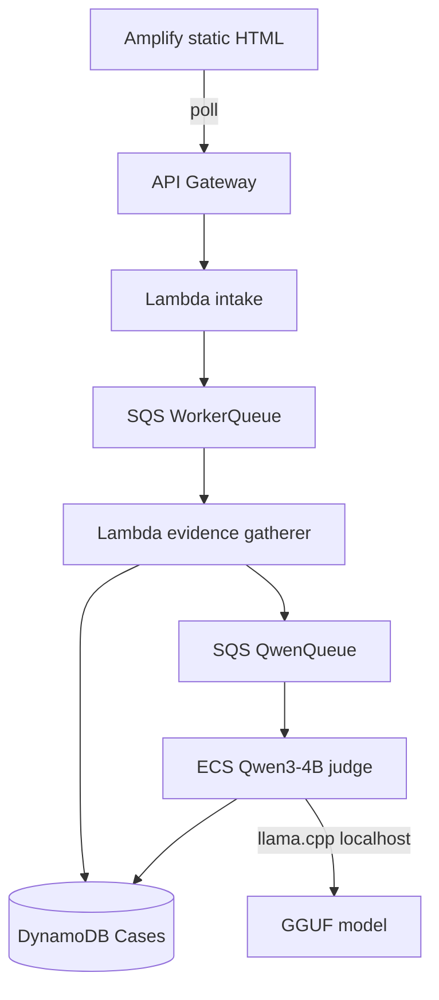

# Hardened MVP architecture and remaining work

**Canonical demo:** Mumbai API + Mumbai Amplify (`main.d32sg54oqu2gcb.amplifyapp.com`)  
**Date:** 2026-09-18

## System shape (today)



**Judge pattern:** gather-then-judge (not live tool loop).

1. Lambda runs deterministic **tools** (employer resolve, policy, domain, tactics, vacancy).
2. Qwen receives a compact evidence packet.
3. Qwen returns **decision JSON only** (~80–120 tokens).
4. Worker builds UI blocks server-side and writes `verdict` + `agentPresentation`.

## Why there is a token limit

| Layer | Setting | Purpose |
|---|---|---|
| `QWEN_MAX_TOKENS` (worker env) | `200` | Max **completion** tokens per judge call |
| llama `-n` (server) | `256` | Server-side generation cap |
| `QWEN_INFER_TIMEOUT_S` | `90` | Wall-clock abort → rule fallback |

Token limits exist because:

- CPU inference is ~2–3 tok/s. Every extra token adds ~0.3–0.5s.
- Unbounded output risks **truncated JSON** (the original production bug at 280 tokens with full `blocks[]`).
- Cost and queue latency grow linearly with output size on a single Fargate task.

### Reliability rules (encoded in code)

1. **Never ask the model for `blocks[]`.** UI blocks are built in `judge.py` from evidence + reasoning.
2. **Compact schema only:** `verdict`, `headline`, `confidence`, `citedEvidenceIds`, `reasoning`, `followUpQuestions`.
3. **Loose JSON parser** repairs truncated output before fallback.
4. **Guardrails** veto illegal verdicts (T3-only high_risk, no_conflict without T1 domain+vacancy, injection text).
5. **`agentSource`** field: `qwen` vs `fallback` shown in UI.
6. **`enable_thinking: false`** on Qwen3. Hidden thinking tokens are disabled. Explicit `reasoning` field is kept.

### Tuning guide

| Goal | Action |
|---|---|
| Faster | Lower `QWEN_MAX_TOKENS` to 150, shorten packet excerpts |
| More reliable JSON | Keep compact schema; do not raise tokens to fit blocks |
| Richer prose | Raise to 250 max; monitor `n_gen` in CloudWatch |
| Sub-30s | GPU quota or smaller model; CPU has a hard floor |

Env vars live in `infra/qwen-ecs/template.yaml` and deploy via `scripts/deploy_qwen_ecs.sh`.

## Tool calls and harness (current vs target)

### Today: no runtime tool loop

Qwen does **not** call AWS services directly. The harness is:

| Phase | Actor | "Tools" |
|---|---|---|
| Gather | Lambda `analyze_case()` | employer registry, policy fetch, domain check, tactic regex, vacancy index |
| Judge | ECS `stream_judge()` | single llama.cpp completion |
| Write | ECS `write_judgment()` | DynamoDB UpdateItem |

The model sees tool **outputs** pre-loaded in the evidence packet. It does not decide to invoke SQS, S3, or another Lambda mid-flight.

### Target harness (post-MVP)

For dynamic "use another AWS service" behavior without slow ReAct on CPU:

```
Orchestrator (worker)                    Qwen (judge)
  ├─ tool: resolve_employer()     ──►   packet field
  ├─ tool: fetch_policy()         ──►   packet field
  ├─ tool: search_vacancy()       ──►   packet field
  ├─ tool: optional_web_search()  ──►   packet field (T3 only)
  └─ single judge call            ◄──   verdict JSON
```

Optional Phase 2: bounded 2-step loop (judge requests `need_vacancy_lookup` → orchestrator runs tool → re-judge). Not on CPU MVP path.

## Remaining tasks for hardened MVP

### P0 — ship today

| # | Task | Status | Evidence (2026-09-18) |
|---|---|---|---|
| 1 | Compact judge schema deployed | **Done** | ECS image `hardened-20260918170101` |
| 2 | Injection + no_conflict guardrails | **Done** | Case F → `high_risk`, `agentSource=qwen`, 19s |
| 3 | Mumbai Amplify redeploy | **Done** | Job 4 + 5 succeed; `main.d32sg54oqu2gcb.amplifyapp.com` |
| 4 | `judgeMode` on `/health` | **Done** | `{"judgeMode":"qwen","qwenQueueConfigured":true}` |
| 5 | Re-run 5-case live matrix | **Partial** | A/D/F/B passed; C ambiguous not re-run this session |

**Smoke results (API, post-deploy):**

| Case | Verdict | agentSource | Elapsed |
|---|---|---|---|
| A Amazon fee | `high_risk` | qwen | 30s |
| B Stripe clean | `unverified` | qwen | 18s |
| D Lookalike | `high_risk` | qwen | 70s (queue) |
| F Injection | `high_risk` | qwen | 19s |

**Browser E2E (Amplify):** Amazon demo → full blocks + follow-up reverification → updated reasoning + conversation block.

### P1 — demo hardening (this week)

| # | Task |
|---|---|
| 6 | 60-case labelled regression + latency p50/p95 |
| 7 | UI labels fallback vs Qwen without reading reasoning string |
| 8 | Implement `/coverage` or remove live-API implication from static stats |
| 9 | CloudWatch alarms: ECS task health, Qwen queue depth, DLQ |
| 10 | Purge/requeue playbook for stuck `PENDING` after deploy |

### P2 — product complete

| # | Task |
|---|---|
| 11 | GPU inference (SageMaker g5 quota) or second ECS task for concurrency |
| 12 | Bounded tool loop for vacancy lookup on clean offers |
| 13 | Screenshot intake path |
| 14 | Narrow CORS + WAF |
| 15 | Retire Sydney Amplify app |

## Acceptance gate (public "Qwen-powered" claim)

- ≥95% of 5 smoke cases: `agentSource=qwen`, valid JSON, no fallback
- Injection case cannot flip verdict via pasted instructions
- 60-case regression recorded with FP/FN counts
- p50 < 90s on single Fargate judge (measured)
- Mumbai Amplify works in incognito on a second device

## Deploy commands

```bash
# Lambda
cd creda-aws-backend/outputs/creda-backend && sam build && \
  AWS_PROFILE=creda-dev sam deploy --stack-name creda-mumbai --region ap-south-1 \
  --capabilities CAPABILITY_IAM CAPABILITY_AUTO_EXPAND \
  --parameter-overrides EnableBedrock=false EnableQwen=true \
  EvidencePrefix=bundles/creda-demo-2026-09-17 --no-confirm-changeset --resolve-s3

# ECS judge
cd first_commit_hack && CREDA_QWEN_TAG="hardened-$(date +%Y%m%d%H%M%S)" bash scripts/deploy_qwen_ecs.sh

# Amplify (manual hosting)
cd first_commit_hack/frontend && \
  sed 's|__CREDA_API_URL__|https://x1ed4uf5q9.execute-api.ap-south-1.amazonaws.com|g' index.html > dist/index.html && \
  (cd dist && zip -r ../deploy.zip .) && \
  AWS_PROFILE=creda-dev aws amplify create-deployment --app-id d32sg54oqu2gcb --branch-name main --region ap-south-1
```
