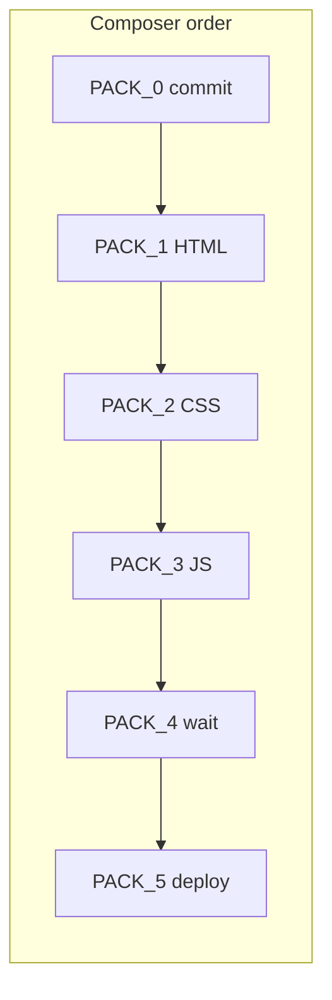

# Creda UI rewrite — Composer execution packs

Paste-ready prompts for Cursor Composer to fix all remaining UI debt on live build `v64-intake-clean` and ship `v65-ui-rewrite`.

**Branch:** `creda/mvp-g4dn-ship`  
**Repo:** `/Users/siva/Documents/first_commit_hack`  
**Live UI:** https://main.d32sg54oqu2gcb.amplifyapp.com/  
**Live API:** https://x1ed4uf5q9.execute-api.ap-south-1.amazonaws.com  
**No PR** unless the human explicitly asks.

---

## Pack order (execute sequentially)

| # | Pack | File | Touches |
|---|------|------|---------|
| 0 | Baseline commit | [UI_PACK_0_baseline_commit.md](./UI_PACK_0_baseline_commit.md) | git only |
| 1 | HTML restructure | [UI_PACK_1_html_restructure.md](./UI_PACK_1_html_restructure.md) | `index.html` |
| 2 | CSS full rewrite | [UI_PACK_2_css_rewrite.md](./UI_PACK_2_css_rewrite.md) | `styles.css` (replace) |
| 3 | JS P0 fixes | [UI_PACK_3_js_p0_fixes.md](./UI_PACK_3_js_p0_fixes.md) | `app.js` |
| 4 | Wait + vectors | [UI_PACK_4_wait_vectors.md](./UI_PACK_4_wait_vectors.md) | `app.js`, `index.html`, `styles.css` |
| 5 | Deploy + verify | [UI_PACK_5_deploy_verify.md](./UI_PACK_5_deploy_verify.md) | Amplify + UI-T1–T12 |

**Do not skip pack 0.** Uncommitted v64 frontend must be committed before the rewrite.

---

## Global Composer rules (every pack)

1. **Vanilla only** — `frontend/index.html`, `styles.css`, `app.js`. GSAP from CDN. No React/npm UI kits.
2. **Exact DOM** — meta bump required; CSS-only theater fails the pack.
3. **Product locks** — no flip-cards; no 720px postcard shell; Qwen writes the stamp; follow-up must not wipe board.
4. **Honest gating** — no screenshot/PDF/upload UI until GPU Path C multimodal is live (out of scope here).
5. **AWS** — profile `creda-dev`, region `ap-south-1`.
6. **No PR.**

---

## Root causes (evidence from code audit)

| Issue | Symptom | File:line | Fix pack |
|-------|---------|-----------|----------|
| Mobile clip | Phone cannot scroll | `styles.css` ~2149–2151 `overflow:hidden` on body without media query | PACK 2 |
| Follow-up hang | "Writing the explanation" forever | `app.js` ~759 `return false` | PACK 3 |
| Board wipe | Follow-up changes stamp/tiles | `app.js` ~1993–2012 `protect` flag | PACK 3 |
| Wait flash | Stamp in ~3.5s | `app.js` ~90–133 `MIN_MS:700` timer-only storyboard | PACK 4 |
| GSAP ghost | Tiles opacity &lt;1 on repeat | `app.js` ~207–210, 265–268 `gsap.from` | PACK 3 |
| Overlap | Stamp blocks Check another | `#judgment-host` sibling of `.result-board`; z-index patches | PACK 1 + 2 |
| Dead CSS | ~700 orphan lines | flip-card, bento, telegram-band, etc. | PACK 2 |
| Dead JS | Console errors | 13 functions, 22 missing DOM ids | PACK 3 |

---

## Target architecture

- **One body class:** `class="creda"` (drops `creda-baseten`, `creda-v58`, `creda-v62`).
- **Mobile-first scroll:** document scrolls below 1024px; viewport lock only on desktop.
- **Two-pane desktop:** intake left (~42%), case file right (~58%), `max-width: min(1760px, 100vw)`.
- **Result DOM:** `#judgment-host` inside `.result-board` after `#exhibits-host`.
- **Wait:** 5 scenes × 1.4s minimum; stamp gated on `readyData`.

---

## What v64 already fixed (confirm on hard refresh)

- Fee/Kit demo chips removed from HTML
- `+` attach button removed from HTML
- Telegram as compact `telegram-chip`
- Two-pane workspace CSS (but layered/conflicted)

---

## Go / no-go checklist (after PACK 5)

### Ship (green paths for 90s demo)

- [ ] Meta live: `baseten-20260919-v65-ui-rewrite`
- [ ] UI-T1–T4 pass (layout + mobile scroll)
- [ ] UI-T5–T7 pass (wait + reveal + Check another)
- [ ] UI-T8–T9 pass (follow-up + repeat cases)
- [ ] UI-T10–T12 pass (CSS hygiene + console + a11y motion)
- [ ] Fee-scam paste → HIGH RISK, tiles visible, opacity 1

### Do not claim in demo

- Screenshot / PDF / image upload on web
- Telegram photo → VLM (`agentSource: creda-vlm`)
- Sub-30s Check on CPU Fargate path
- Arbitrary open-web search per request

---

## Out of scope (separate track)

- **GPU Path C** — `scripts/creda_gpu_up.sh`, g4dn + vLLM, Telegram photos
- **Opus filled audit** — `docs/CREDA_OPUS_AUDIT_AND_PACKS.md` (not written)
- **GitHub PR**

---

## Quick start for Composer

Copy the entire contents of **UI_PACK_0** as your first Composer message. When verify passes, proceed to PACK_1, and so on. Do not merge packs — each has its own verify block.

---

## Related docs

- [CREDA_OPUS_MASTER_AUDIT_COMPOSER_HANDOFF.md](../CREDA_OPUS_MASTER_AUDIT_COMPOSER_HANDOFF.md) — original Opus brief (backend + broader scope)
- [BUGFIX_v63_REVEAL_FOLLOWUP.md](../BUGFIX_v63_REVEAL_FOLLOWUP.md) — prior P0 fix attempt (superseded by PACK 3–4)
- [design-research.md](../design-research.md) — ElevenLabs/Baseten reference measurements
- [layout-audit.md](../layout-audit.md) — 720px shell root cause (fixed in v60, enforced in PACK 2)
